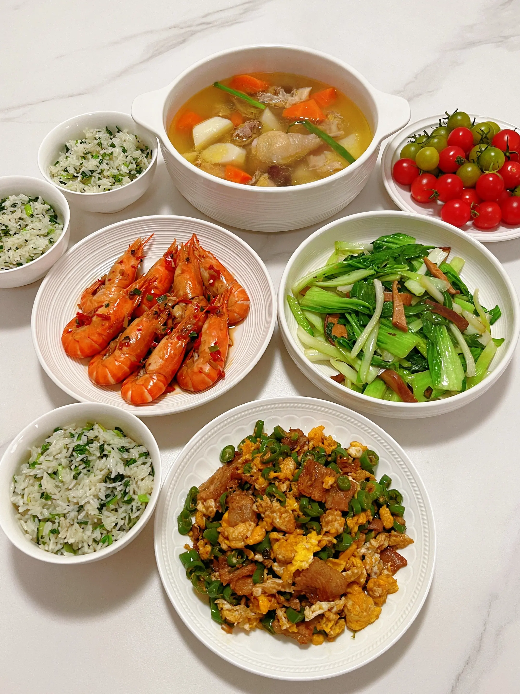

# Object Recognition

We can use MiniCPM-V-4_5 to perform object recognition tasks on images.

```python
from PIL import Image
import torch
from transformers import AutoModel, AutoTokenizer

model_path = 'openbmb/MiniCPM-V-4_5'
model = AutoModel.from_pretrained(model_path, trust_remote_code=True,
                                  # sdpa or flash_attention_2, no eager
                                  attn_implementation='sdpa', torch_dtype=torch.bfloat16)
model = model.eval().cuda()
tokenizer = AutoTokenizer.from_pretrained(
    model_path, trust_remote_code=True)

image = Image.open('./assets/single.png').convert('RGB')

question = "What is the landform in the picture?"
msgs = [{'role': 'user', 'content': [image, question]}]

answer = model.chat(
    msgs=msgs,
    image=image,
    tokenizer=tokenizer
)
print(answer)
```

Image:


Result:

```
The landform in the picture is a mountain range. The image shows steep cliffs, rugged terrain, and a winding path that ascends between two prominent rocky peaks covered with green vegetation. This type of landscape features high elevations and dramatic slopes characteristic of mountains.
```

# Object Spot

We can also use MiniCPM-V-4_5 to perform object spotting tasks on images.

```python
from PIL import Image
import torch
from transformers import AutoModel, AutoTokenizer

model_path = 'openbmb/MiniCPM-V-4_5'
model = AutoModel.from_pretrained(model_path, trust_remote_code=True,
                                  # sdpa or flash_attention_2, no eager
                                  attn_implementation='sdpa', torch_dtype=torch.bfloat16)
model = model.eval().cuda()
tokenizer = AutoTokenizer.from_pretrained(
    model_path, trust_remote_code=True)

image = Image.open('./assets/multi_object.png').convert('RGB')

question = "Identify food in the image and return their bounding box and Chinese and English name in JSON format."
msgs = [{'role': 'user', 'content': [image, question]}]

answer = model.chat(
    msgs=msgs,
    image=image,
    tokenizer=tokenizer
)
print(answer)
```

Image:


Result:

```
{
  "food_1": {
    "bounding_box": "<box>520 637 644 782</box>",
    "chinese_name": "炒鸡蛋",
    "english_name": "Fried eggs"
  },
  "food_2": {
    "bounding_box": "<box>9 329 194 480</box>",
    "chinese_name": "蔬菜白米饭",
    "english_name": "Vegetable white rice"
  },
  "food_3": {
    "bounding_box": "<box>43 505 310 670</box>",
    "chinese_name": "蔬菜白米饭",
    "english_name": "Vegetable white rice"
  },
  "food_4": {
    "bounding_box": "<box>15 157 312 327</box>",
    "chinese_name": "蔬菜白米饭",
    "english_name": "Vegetable white rice"
  },
  "food_5": {
    "bounding_box": "<box>435 20 737 324</box>",
    "chinese_name": "鸡汤",
    "english_name": "Chicken soup"
  },
  "food_6": {
    "bounding_box": "<box>496 341 951 574</box>",
    "chinese_name": "炒青菜",
    "english_name": "Stir-fried greens"
  },
  "food_7": {
    "bounding_box": "<box>203 345 542 574</box>",
    "chinese_name": "蒜蓉粉丝蒸虾",
    "english_name": "Garlic and vermicelli steamed shrimp"
  },
  "food_8": {
    "bounding_box": "<box>729 1 1000 314</box>",
    "chinese_name": "圣女果",
    "english_name": "Cherry tomatoes"
  }
}
```